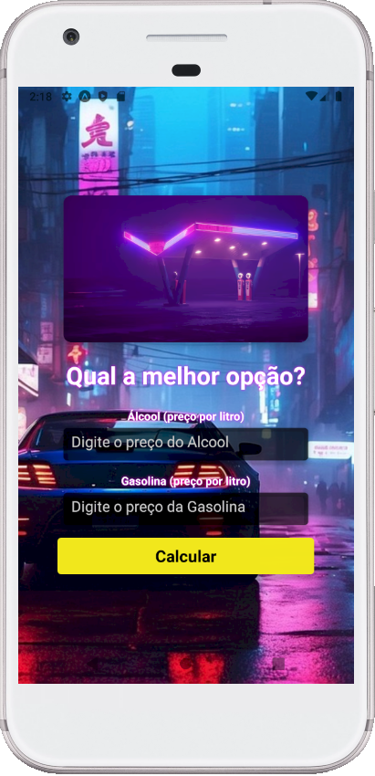

# Desafio da disciplina de Programação para Dispositivos Móveis em Android

Objetivo: Desenvolver um aplicativo simples em React Native para calcular se é mais vantajoso abastecer com Álcool ou Gasolina

Entenda como o cálculo é feito
- Dividimos o valor do litro do álcool pelo da gasolina
- Quando o resultado é menor que 0.7 a recomendação é abastecer com álcool Se maior, a recomendação é escolher a gasolina
- Exemplo se o álcool custa R 3 29 e a gasolina R 4 92 o resultado da divisão do primeiro pelo segundo é 0 67 menor que 0 7 Portanto, é mais vantajoso abastecer com álcool

## 📷 Prints
*()*
